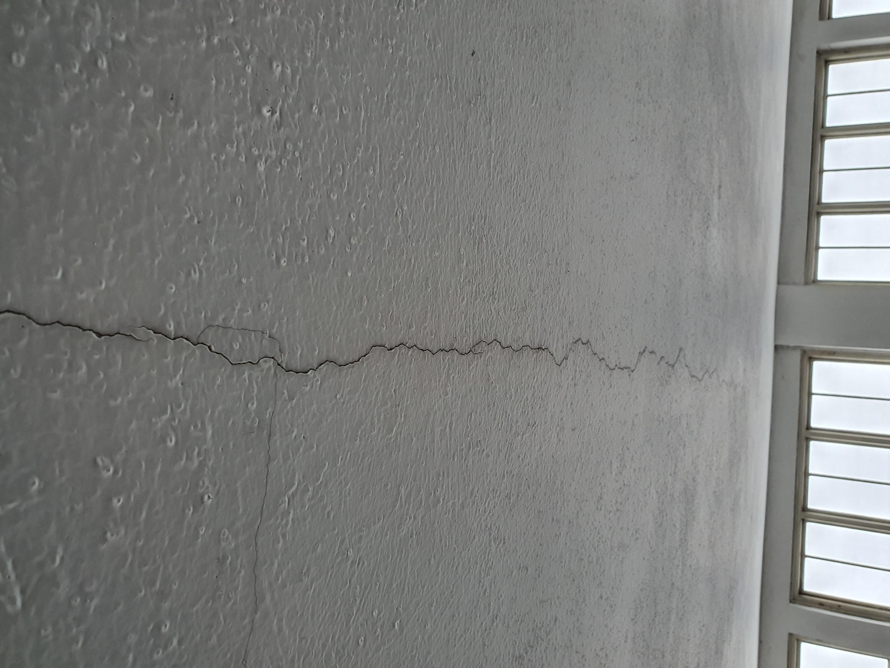
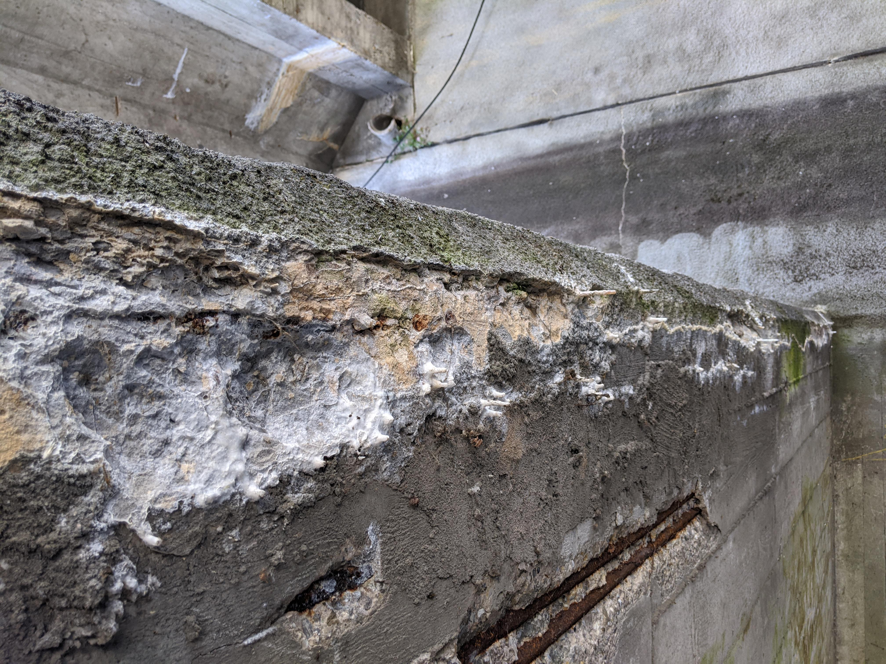

# dacl-demo

*dacl-demo* is a tutorial repo to demonstrate how to use baselines from [*bikit*](https://github.com/phiyodr/building-inspection-toolkit) or rather [*dacl.ai*](https://dacl.ai) for inference in order to tackle the problem of damage recognition on built structures together.

[***bikit***](https://github.com/phiyodr/building-inspection-toolkit) is a simple to use data hub containing relevant open-source datasets in the field of damage recognition. The *bikit's* datasets are enriched with evaluation splits and predefined metrics, suiting the specific task and their data distribution. The according paper is available [here](https://arxiv.org/abs/2202.07012).

[***dacl.ai***](https://dacl.ai) provides a leaderboard and the most important metrics for the baselines in this field.
In addition, it endorses damage recognition enthusiasts to train models on available data by themselves and to submit the results. Also, check out the [poster](#poster).


## Usage

As soon as you have installed the requirements listed in `requirements.txt` you can unleash the whole dacl power inside the jupyter notebook `demo.ipynb`. Inside the notebook every step will be explained in detail. 

Feel free to load different images into the DamageExample directory and evaluate the *dacl* models on your own data!

|<p align="mid"></p>|<p align="mid"></p>|
|:--:|:--:| 
|<p align="mid"></p>|<p align="mid"></p>|


***Examples of images representing detectable damage with available dacl-models.** Crack (Top left); Spalling, Effloresence, Rust (Top right); Crack, Efflorescence (Bottom left); Spalling, Effloresence, BarsExposed, Rust (Bottom right)*

## Available Models

The available models are displayed in the table below. They are sorted according to the Exact Match Ratio (EMR), which is the most important metric for multi-target classification. Further information reagarding the models and the metrics may be found on [dacl.ai](https://dacl.ai/bikit.html) and the [*bikit*-paper](https://arxiv.org/abs/2202.07012).

| Modelname             | Dataset           | EMR   | F1   | Tag          | Checkpoint                |CorrespNameOnBikit*                   |
|-----------------------|-------------------|-------|------|--------------|---------------------------|--------------------------------------|
| Code_res_dacl         | codebrim_balanced | 73.73 | 0.85 | ResNet       | Code_res_dacl.pth         |CODEBRIMbalanced_ResNet50_hta         |
| Code_mobilev2_dacl    | codebrim_balanced |70.41  | 0.84 | MobileNetV2  | Code_mobilev2_dacl.pth    |CODEBRIMbalanced_MobileNetV2          |
| Code_mobile_dacl      | codebrim_balanced | 69.46 | 0.83 | MobileNet    | Code_mobile_dacl.pth      |CODEBRIMbalanced_MobileNetV3Large_hta |
| Code_eff_dacl         | codebrim_balanced | 68.67 | 0.84 | EfficientNet | Code_eff_dacl.pth         |CODEBRIMbalanced_EfficientNetV1B0_dhb |
| McdsBikit_mobile_dacl | mcds_bikit        | 54.44 | 0.66 | MobileNet    | McdsBikit_mobile_dacl.pth |MCDSbikit_MobileNetV3Large_hta        |
| McdsBikit_eff_dacl    | mcds_bikit        | 51.85 | 0.65 | EfficientNet | McdsBikit_eff_dacl.pth    |MCDSbikit_EfficientNetV1B0_dhb        |
| McdsBikit_res_dacl    | mcds_bikit        | 48.15 | 0.62 | ResNet       | McdsBikit_res_dacl.pth    |MCDSbikit_ResNet50_dhb                |

**CorrespNameOnBikit* displays the name which you can utilize to download the model via *bikit*. For further information about how to get the baselines from *bikit* check out the ***Models*** section in the README of [*bikit*](https://github.com/phiyodr/building-inspection-toolkit). 

## Structure

```
├── assets
│   └── *.jpg # example images
├── cat_to_name.json # Contains labels for each dataset
├── demo.ipynb # Main code
├── LICENSE
├── models
│   └── *.pth # checkpoints
├── README.md
└── requirements.txt
```

## Poster

Check out the original poster [here](https://www.researchgate.net/publication/362592830_Become_Part_of_daclai_Develop_Machine_Learning_Models_for_Damage_Recognition_on_Built_Structures)!

