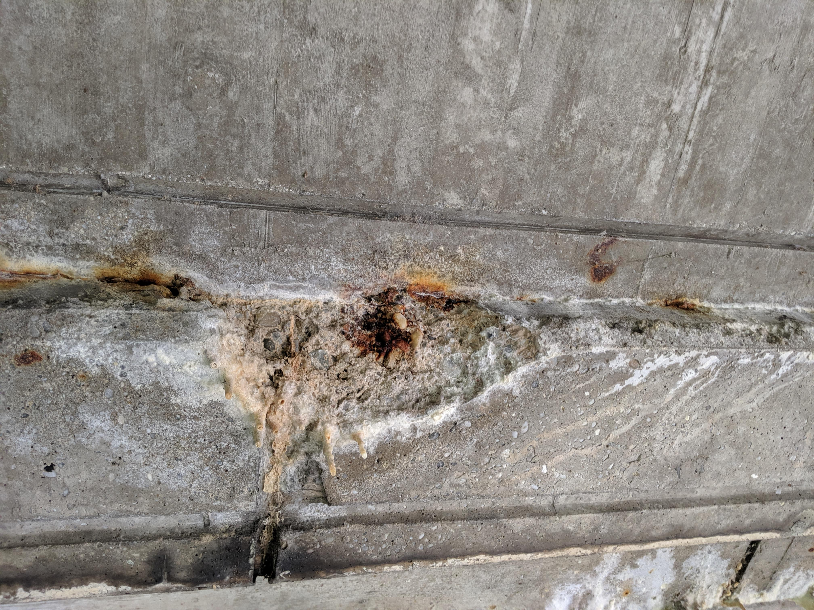
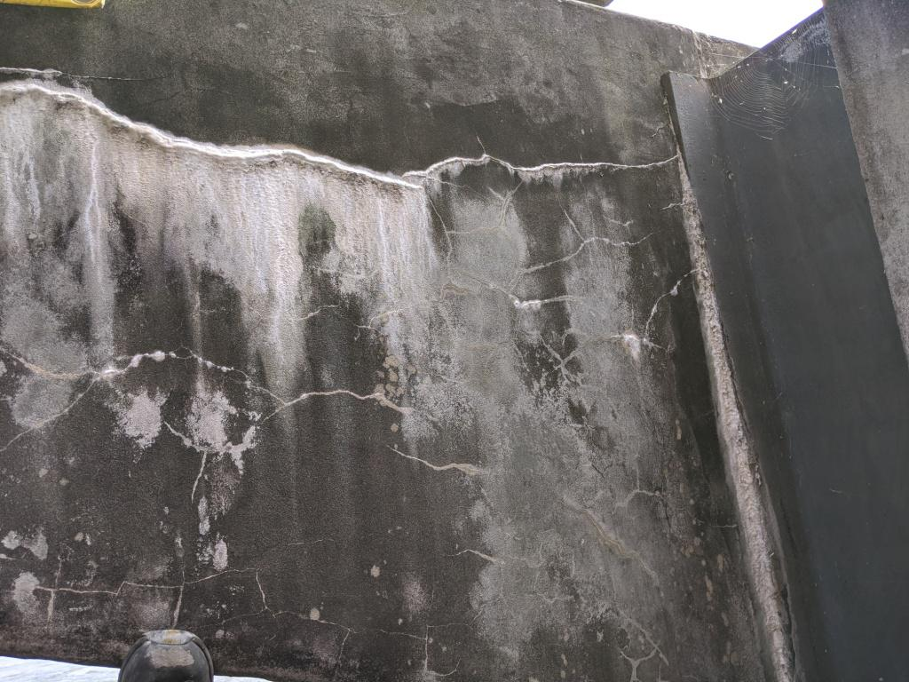

# dacl-demo

Repo to demonstrate how to use baselines from bikit and dacl.ai.

|<p align="mid"></p>|<p align="mid"></p>|
|:--:|:--:| 
|<p align="mid"></p>|<p align="mid"></p>|


***Examples of images representing detectable damage with available dacl-models.** Crack (Top left); Spalling, Effloresence, BarsExposed, Rust (Top right); Crack, Efflorescence (Bottom left); Spalling, Effloresence, BarsExposed, Rust (Bottom right)*

## Available Models

| Modelname             | Dataset           | EMR   | F1   | Tag          | Checkpoint                |
|-----------------------|-------------------|-------|------|--------------|---------------------------|
| Code_res_dacl         | codebrim_balanced | 73.73 | 0.85 | ResNet       | Code_res_dacl.pth         |
| Code_mobilev2_dacl    | codebrim_balanced |70.41  | 0.84 | MobileNetV2  | Code_mobilev2_dacl.pth    |
| Code_mobile_dacl      | codebrim_balanced | 69.46 | 0.83 | MobileNet    | Code_mobile_dacl.pth      |
| Code_eff_dacl         | codebrim_balanced | 68.67 | 0.84 | EfficientNet | Code_eff_dacl.pth         |
| McdsBikit_mobile_dacl | mcds_Bikit        | 54.44 | 0.66 | MobileNet    | McdsBikit_mobile_dacl.pth |
| McdsBikit_eff_dacl    | mcds_Bikit        | 51.85 | 0.65 | EfficientNet | McdsBikit_eff_dacl.pth    |
| McdsBikit_res_dacl    | mcds_Bikit        | 48.15 | 0.62 | ResNet       | McdsBikit_res_dacl.pth    |


## Structure

```
dacl_demo
├── assets
	└── *.jpg #example images
├── demo.ipynb # Main code
├── cat_to_name.json
└── models
	└── *.pth #checkpoints
```